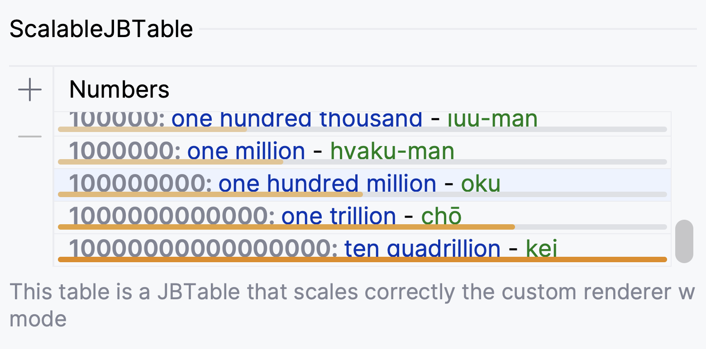
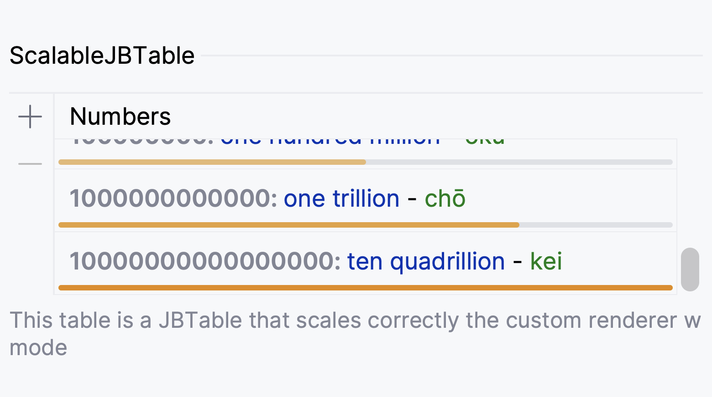
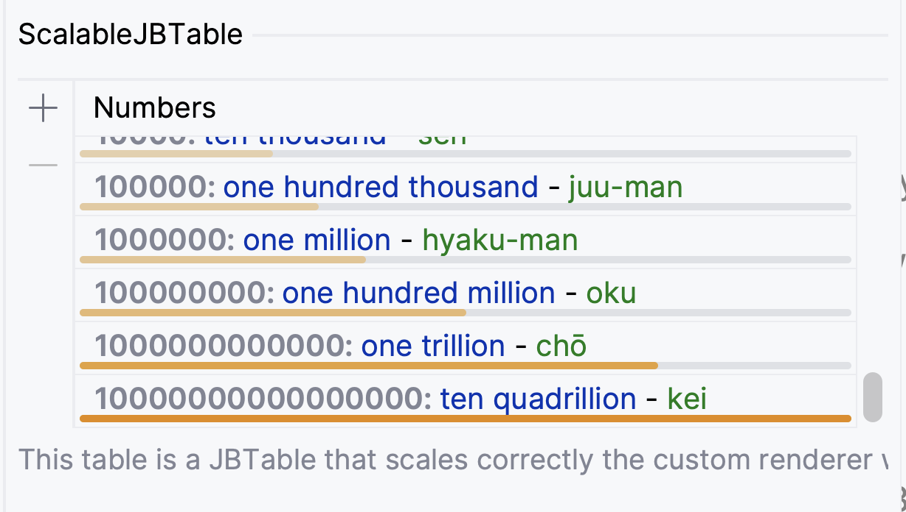
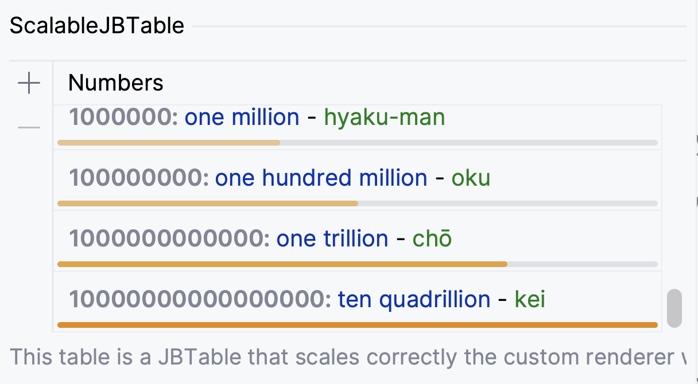
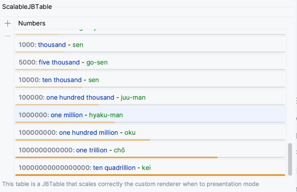
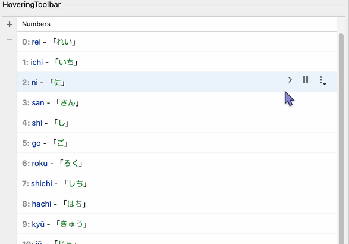
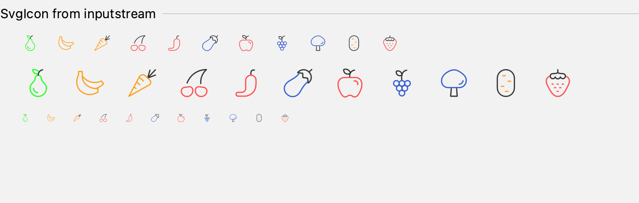

= IntelliJ Platform Swing Components

[link=https://github.com/bric3/intellij-platform-swing-components/actions/workflows/build.yaml]
image::https://github.com/bric3/intellij-platform-swing-components/actions/workflows/build.yaml/badge.svg[Build Workflow]

The goal of this project is to build a library of UI components
for the IntelliJ Platform, since IntelliJ is based on Swing, these
components are pure Swing but may use IntelliJ specific APIs.

The primary language is Kotlin, but using these components from Java
should be supported, if not then it's an API bug.

== Demo of these components is provided via the demo plugin.

Run the `:components-demo-plugin:runIde` task to launch the demo plugin.

[source,bash]
----
./gradlew :components-demo-plugin:runIde
----

Or the shipped run configuration _demo-plugin [runIde]_ for IntelliJ IDEA.

== Components

* `ScaledJBTable` and `ScaledTableView` fix an issue regarding the row height
when using custom renderer and switching back and forth between presentation mode.
+ Compare without and with the fix:
+
.Presentation mode *before* fix

+
.Presentation mode *after* fix

+
.Zoom at 150% *before* fix

+
.Zoom at 150% *after* fix

* `ColoredProgressBar`, it allows using a custom color for the progress bar,
the `JProgressBar` with the regular DarculaUI does not allow that.
+

* `HoveringToolbar` allows showing a toolbar when hovering a table row.
+

* `SvgIcon` allows using SVG icons, it is based on the `SvgIcon` from JSVG
+

* `ExpandableSplitter` allows to expand/collapse a component in a similar way as the Git Toolwindow to show branches.
+

== Tests

I don't exactly know how to test Swing components at this time,
so this part is skipped for now. This is definitely an area that
needs help.

== License

This work is licensed under *Mozilla Public License 2.0*, basically
this license allows commercial use and distribution under a proprietary
license, but it is required:

. to mention the origin and the associated license somewhere.
. to disclose any modifications under the same license.

For more details it is encouraged to read the https://www.mozilla.org/en-US/MPL/2.0/[license itself].

> IntelliJ Platform Swing Components
>
> Copyright (c) 2023 - Brice Dutheil
>
> This Source Code Form is subject to the terms of the Mozilla Public
> License, v. 2.0. If a copy of the MPL was not distributed with this
> file, You can obtain one at https://mozilla.org/MPL/2.0/.
>
> SPDX-License-Identifier: MPL-2.0